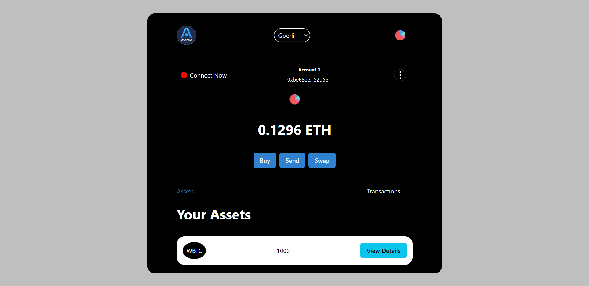

# Non Custodial Wallet

This is a Non-Custodial Ethereum wallet like metamask supporting two chains for now.

The Chains are 

- Ethereum Mainnet 
- Ethereum Goerli

We Currently support 15 Mainnet Tokens . The Goal is to support 50+ assets.

Details to be added
